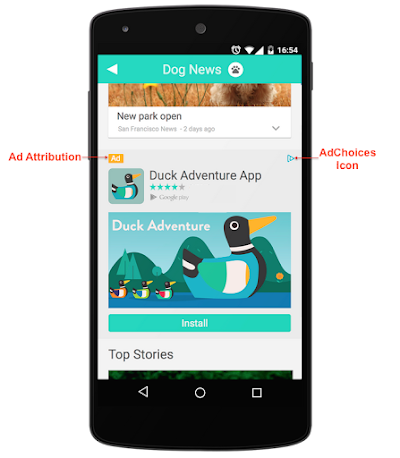

# Native_Ads

Native advertising is the use of paid ads that match the look, feel and function of the media format in which they appear. Native ads are often found in social media feeds, or as recommended content on a web page.

